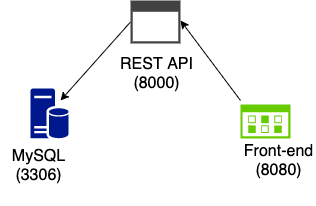

# Patient Tracker

REST API to monitor Patient Data written in Golang, with a mySQL database. The frontend is created using VueJS with each service containerized with Docker.



## Project Setup
Must have Docker Desktop/docker-compose on your machine to run each service.
```
docker-compose up
```

## Login
The server generates a json web token to validate the user within the client. Currently, the login is setup for testing with the test credentials listed below.   
```
Username: test
Password: test
```